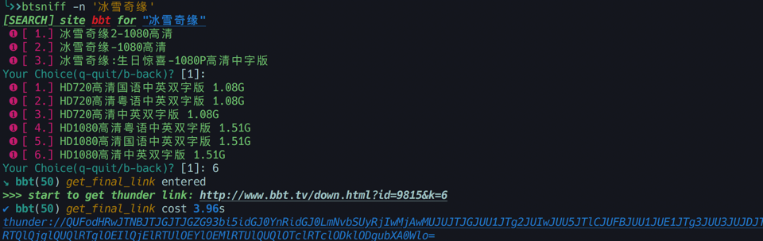
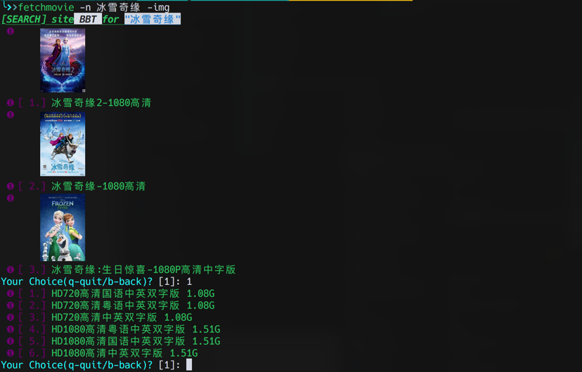

# btsniff

sniff movies url or torrents.

usually there are lot's of ads on these websites, so this will help you with only the bt torrents, just enjoy it.

by default, a cache directory will be created at "/tmp/crawler/" with name of each site. i.e. for site `http://www.bbt.tv` it will be `"/tmp/crawler/www.bbt.tv"`. every searched result page is stored in this folder, so next time you search the same name, you will hit local cached page, but this can be overwritten with `-w --overwrite` parameter.

## sites supported

- [x] [bbt](http://www.bbt.tv)
- [x] [btdx8](https://www.btdx8.com/)
- [x] [dygod](https://www.dy2018.com/)

## install

```shell script
pip install btsniff
```

## USAGE

### show help

```sh
btsniff -h
Usage: btsniff [OPTIONS]

Options:
  -n, --name TEXT      movie/actor name [OPT] -n <name>
  -s, --site TEXT      site name [OPT] -s <site_name>
  -l, --list_sites     list supported sites [OPT] -l
  -w, --overwrite      overwrite local cache [OPT] -w
  -img, --display_img  display with image [OPT] -img
  -h, --help           Show this message and exit.
```

### view all available sites

```sh
btsniff -l
Available sites:
     bbt [bt电影天堂: http://www.btbttv.cc/]
   btdx8 [比特大雄: https://www.btdx8.com/]
   dygod [电影天堂: https://www.dy2018.com/]
```
### sniff by name

> simple search



> with image supported


